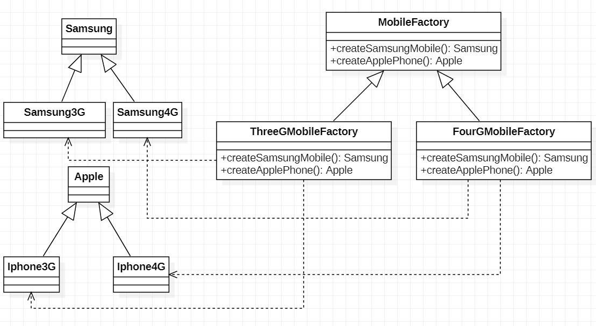

## Design Principle
   - Identify the aspects of your application that vary and separate them from what stays same. ( Take the parts that vary and encapsulate them, so that later you can alter or extend the parts that vary without affecting those that don’t.)
   
   - Program to an interface, not an implementation.
   
   - Favor composition over inheritance

# design-patterns

Dependency Inversion Principle

There are two parts in this principle
- High-Level modules should not depend on the Low-Level modules. Both should depend on abstractions.
- Abstraction should not depend on details. Details should depend on abstraction.

## Factory Method
The Factory Method pattern defines an interface for creating an object, but lets the subclasses decide which class to instantiate. Factory Method lets a class defer instantiation to subclasses.

## Abstract Factory
The Abstract Factory pattern provides an interface for creating families or related or dependent objects without specifying their concrete classes.

## Startegy Pattern
The Strategy Pattern defines a family of algorithms, encapsulates each one, and makes them interchangeable. Strategy lets the algorithm vary independently from clients that use it.

