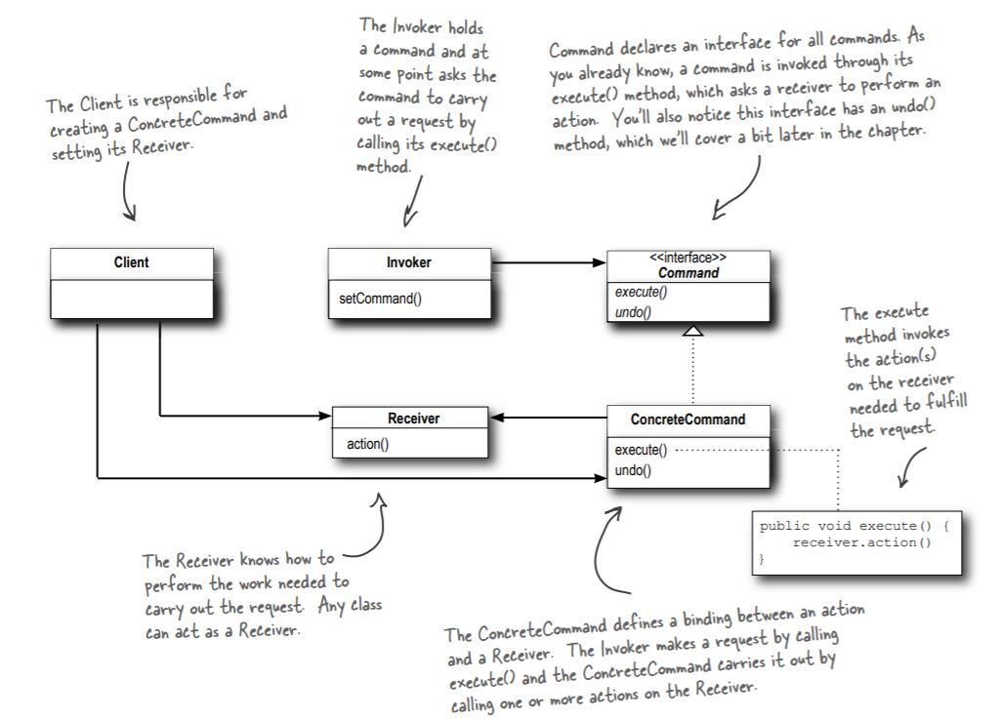

## Design Principle
   - Identify the aspects of your application that vary and separate them from what stays same. ( Take the parts that vary and encapsulate them, so that later you can alter or extend the parts that vary without affecting those that don’t.)
   - Program to an interface, not an implementation.
   - Favor composition over inheritance
   - Classes should be open for extension, but closed for modification.
   - Principle of Least Knowledge, talk only to your immediate friends
   
## Gamma Categorization

   | Creational        | Structural    |   Behavioral              |
   | -------------     | ------------- | ------------------------  | 
   | Builder           | Adapter       | Command                   |
   | Factory Method    | Decorator     | Observer                  |
   | Abstract Factory  | Facade        | Strategy                  |
   | Singleton         | Proxy         | Chain of Responsibilities |
   | Prototype         | Bridge        | Interpreter               |
   |                   | Composite     | Iterator                  |
   |                   | Flywieght     | Mediator                  |
   |                   |               | Memento                   |
   |                   |               | Null Object               |
   |                   |               | State                     |
   |                   |               | Template Method           |
   |                   |               | Visitor                   |

# design-patterns

Dependency Inversion Principle

There are two parts in this principle
- High-Level modules should not depend on the Low-Level modules. Both should depend on abstractions.
- Abstraction should not depend on details. Details should depend on abstraction.

## Factory Method
The Factory Method pattern defines an interface for creating an object, but lets the subclasses decide which class to instantiate. Factory Method lets a class defer instantiation to subclasses.

## Abstract Factory
The Abstract Factory pattern provides an interface for creating families or related or dependent objects without specifying their concrete classes.

## Startegy Pattern
The Strategy Pattern defines a family of algorithms, encapsulates each one, and makes them interchangeable. Strategy lets the algorithm vary independently from clients that use it.

## Decorator Pattern
The Decorator Pattern attaches additional responsibilities to an object dynamically. Decorators provide a fl exible alternative to
subclassing for extending functionality.

## Adapter Pattern
The Adapter Pattern converts the interface of a class into another interface the clients expect. Adapter lets classes work together that couldn’t otherwise because of incompatible interfaces.

## Facade Pattern
The Facade Pattern provides a unifi ed interface to a set of interfaces in a subsytem. Facade defi nes a higherlevel interface that makes the subsystem easier to use.

## Command Pattern
The Command Pattern encapsulates a request as an object, thereby letting you parameterize other objects with different requests, queue or log requests, and support undoable operations

## Builder Pattern
Separate the construction of a complex object from its representation so that the same construction process can create different representations.

## Observer Pattern
The Observer Pattern defines a one-to-many dependency between objects so that when one object changes state, all of its dependents are
notified and updated automatically

## Proxy Pattern
The Proxy Pattern provides a surrogate or placeholder for another object to control access to it.

